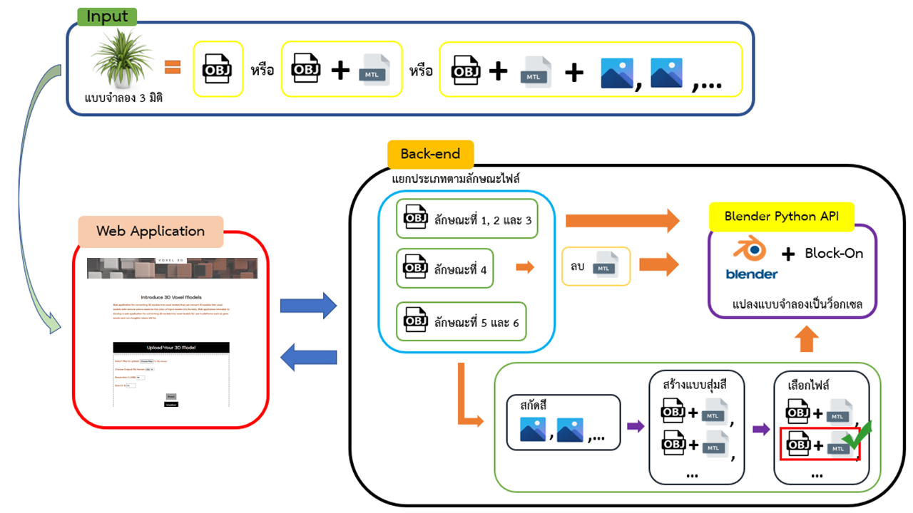
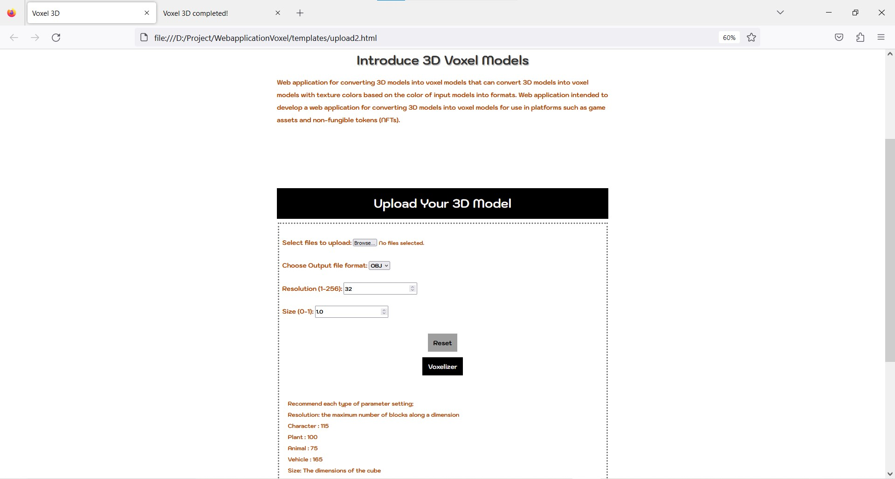
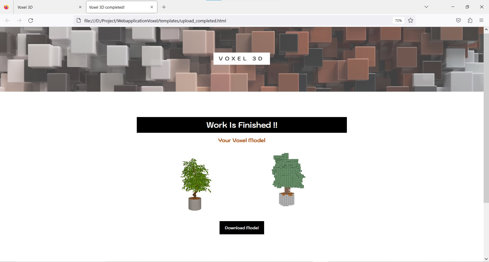
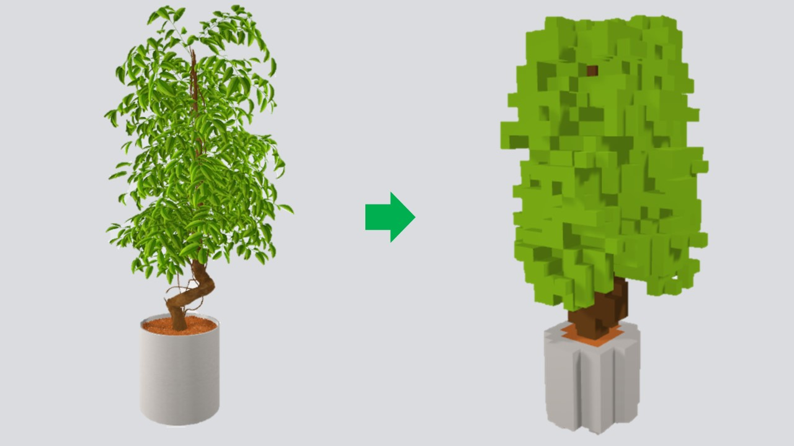

# WebapplicationVoxel
Web application for convert OBJ 3d models to voxel format.

- Research Paper ([web page](https://naruemonssp.github.io/VoxelPage/))

## Overview
<p align="center">
  
</p>

## Requirement
### Library for create webapplication
  ```
  pip install flask
  ```
  
### Setup pytorch3d library
1. Install anaconda
2. Create an environment 
    ```
    conda create -n pytorch3d python=3.9
    conda activate pytorch3d
    conda install pytorch=1.13.0 torchvision pytorch-cuda=11.6 -c pytorch -c nvidia
    conda install -c fvcore -c iopath -c conda-forge fvcore iopath
    ```
3. Install pytorch3d
    ```
    git clone https://github.com/facebookresearch/pytorch3d.git
    cd pytorch3d && pip install -e .
    ```

### Blender & Setup
  Available versions 
  - Blender 3.0 - 3.3 only ([download blender3.3](https://download.blender.org/release/Blender3.3/))
#### Setup blender
  - Download **[Block On](https://github.com/BrendanParmer/Block-On)**
      ```
      git clone https://github.com/BrendanParmer/Block-On.git
      ```    
  - Follow these steps:
  
      [How to install block on in blender](static/Images/InstallAddonblender.pdf)
      
 
## Usage
1. Clone this project:
    ```
    git clone https://github.com/jittakorn-ch/WebapplicationVoxel.git
    ```
2. Set path in `setpath.txt` file
3. Open `command prompt` or `terminal` navigate to directory `WebapplicationVoxel`
4. Activate pytorch3d
    ```
    conda activate pytorch3d
    ```
5. Run `server.py`
    ```
    python server.py
    ```
6. Now you can open webapplication in your browsers.


## Example of webapplication


Upload page:
  <p align="center">
    
  </p>

Output page:
  <p align="center">
    
  </p>

Output example:
  <p align="center">
    
  </p>
